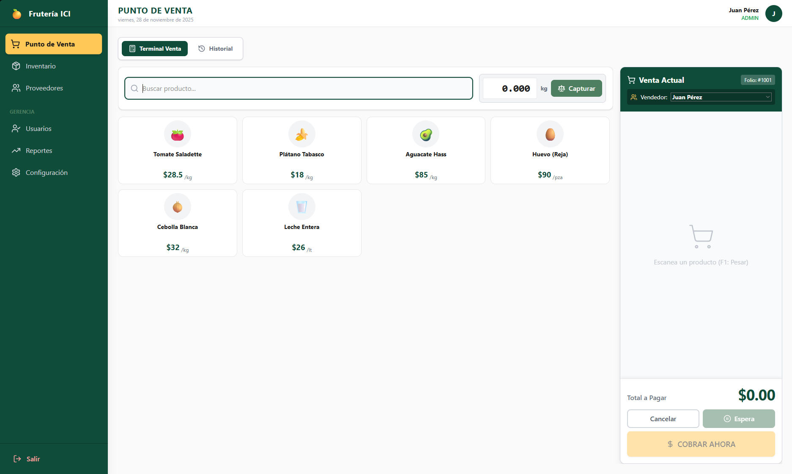

# 📌 Frutería ICI – Sistema de Punto de Venta (POS)


---

## Descripción del Proyecto

**Frutería ICI POS** es un sistema de gestión integral y punto de venta web diseñado para pequeños negocios minoristas, especialmente **fruterías y abarrotes**.

El sistema reemplaza procesos manuales mediante una plataforma digital eficiente que permite controlar:

- Ventas  
- Inventarios  
- Compras y proveedores  
- Finanzas  
- Usuarios y seguridad  

Construido con una **arquitectura modular en React**, está optimizado para funcionar tanto en **pantallas táctiles** como en **escritorio** para una operación ágil.

---

## Características Principales

### Módulo de Ventas (POS)

- **Terminal de Venta Ágil:** Botones grandes y atajos de teclado (F1, F2, ESC).
- **Manejo de Pesaje:** Captura simulada de peso para productos a granel (preparado para Web Serial API).
- **Carrito Dinámico:** Agrupación inteligente por producto con cálculo automático por unidad o por kilo.
- **Múltiples Métodos de Pago:** Efectivo, Tarjeta, Transferencia y Vales.
- **Tickets en Espera:** Permite pausar una venta y recuperarla más tarde.

---

### Inventario y Almacén

- **CRUD Completo:** Altas, bajas y edición de productos con imágenes o emojis.
- **Semáforo de Stock:** Indicadores visuales cuando el inventario es bajo o crítico.
- **Gestión de Mermas:** Registro de pérdidas (daño, maduración, robo) y su impacto financiero.
- **Actualización Masiva de Precios:** Estilo hoja de cálculo para cambios rápidos.

---

### Proveedores y Compras

- **Directorio de Proveedores:** Teléfono, dirección, notas y días de visita.
- **Cuentas por Pagar:** Registro de deuda acumulada y abonos.
- **Entradas de Almacén:** Actualizan stock y calculan costo promedio ponderado.

---

### Reportes y Finanzas

- **Dashboard Financiero:** Ventas totales, utilidad bruta y flujo de efectivo.
- **Corte de Caja:** Apertura, arqueo y cierre de turno.
- **Análisis de Negocio:** Tendencias por día/semana/mes y rankings de productos.
- **Exportación:** Descarga de reportes detallados a CSV y Excel.

---

### Administración y Seguridad

- **Roles de Usuario:** Administrador, Vendedor y Dueño.
- **Respaldo de Datos:** Exportación e importación de la base completa en JSON.

---

## Tecnologías Utilizadas

- **Frontend:** React.js (Hooks + Context API)  
- **Compilación:** Vite  
- **Estilos:** Tailwind CSS  
- **Iconos:** Lucide React  
- **Lenguaje:** JavaScript (ES6+)

---

## Estructura del Proyecto

src/
├── components/      # Componentes UI reutilizables (Botones, Inputs, Cards, Modales)
├── modules/
│   ├── admin/       # Gestión de usuarios y configuración
│   ├── auth/        # Pantallas de login y autenticación
│   ├── inventory/   # Productos, precios, stock, mermas
│   ├── pos/         # Terminal de venta, carrito, checkout
│   ├── reports/     # Reportes, gráficas y cortes de caja
│   └── suppliers/   # Proveedores, compras y cuentas por pagar
├── data/            # Mock data inicial para pruebas
└── utils/           # Helpers, formateadores, validaciones

---

## Instalación y Despliegue

### Prerrequisitos

- Node.js **16 o superior**
- npm o yarn

---

### Pasos de Instalación

#### 1. Clonar el repositorio

```bash
git clone https://github.com/Alann-89 Sistema-de-Gestion-de-Fruteria
cd Sistema-de-Gestion-de-Fruteria
```

#### 2. Instalar las dependencias
```bash
npm install
# o
yarn install
```

#### 3. Ejecutar entorno de desarrollo
```bash
npm run dev
# o
yarn dev
```

#### 4. Abrir en el navegador
http://localhost:5173

---

### Usuarios por Defecto (Demo)
| Rol           | Usuario / PIN | Contraseña | Acceso    |
|---------------|----------------|------------|-----------|
| Administrador | 1234           | N/A        | Total     |
| Vendedor      | 0000           | N/A        | Solo POS  |


Puedes añadir usuarios y credenciales desde el módulo de administración.